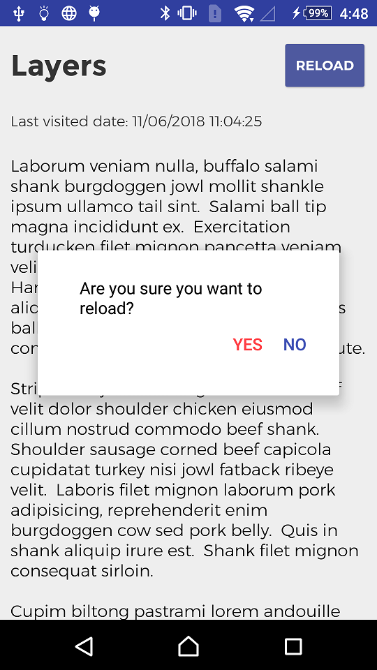
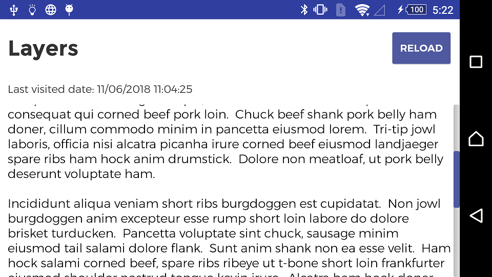

# Android Layers

## Architecture

- The application uses a layered architecture (`ui`, `presenter`, `domain` and `data`). 
- Each layer has its own models with its mappers.
- The `ui` layer gets all what it needs from the `presenter` layer.
- The `presenter` layer is the _man in the middle_ that connects the visual part (`ui` layer) with the data through the `domain` layer.
- The `domain` layer manages the background calls to the `data` layer.
- The `data` layer is a `repository`. This layer gets the data from a `client`. The `client`, through a `service`, accesses this data.-

## Screenshots

## License
    Copyright 2018 Esteban Latre

    Licensed under the Apache License, Version 2.0 (the "License");
    you may not use this file except in compliance with the License.
    You may obtain a copy of the License at

        http://www.apache.org/licenses/LICENSE-2.0

    Unless required by applicable law or agreed to in writing, software
    distributed under the License is distributed on an "AS IS" BASIS,
    WITHOUT WARRANTIES OR CONDITIONS OF ANY KIND, either express or implied.
    See the License for the specific language governing permissions and
    limitations under the License.
